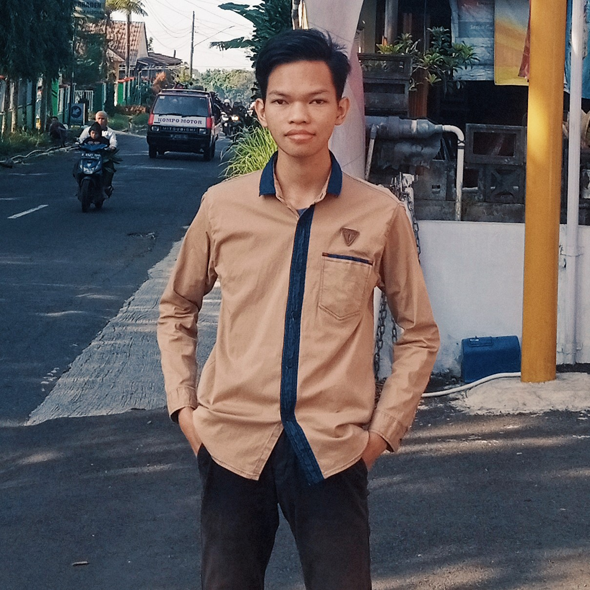

<!-- Sumber Daya -->
<link rel="stylesheet" href="./assets/css/notebook.css">
<link rel="stylesheet" href="./assets/css/iconbook.css">

<!-- Peralatan -->

  

    
  

  <a href="#tentang-penulis" class="nb-action-pill nb-action-btn">Tentang Penulis</a>
  <button onclick="randomNote()" class="nb-action-pill nb-action-btn" aria-label="Baca tulisan acak">Baca Acak</button>
  <button onclick="sharePage()" class="nb-action-pill nb-action-btn" aria-label="Bagikan halaman ini">Bagikan</button>

<!-- Ringkasan -->

Jejak langkah pikiran yang sengaja dibiarkan tak beraturan. Sebuah perjalanan yang membawamu menyelami makna dalam satu waktu lalu merayakan hal-hal tak masuk akal di lembar berikutnya.

<!-- Catatan -->

  <a href="./serat-lakon-anoman" class="nb-card">
    

      

        <i class="ph--note"></i>
        Jum, 6 Feb 2026
      

      <h3 class="nb-title">Serat Lakon Anoman</h3>
      
Dari gelap jadi terang. Sang perkasa dari legenda.

    

    

      #wayang#dongeng
      #ceritarakyat
    

  </a>
  <a href="./prolog-dari-sebuah-akhir" class="nb-card">
    

      

        <i class="ph--note"></i>
        Min, 29 Jun 2025
      

      <h3 class="nb-title">Prolog dari Sebuah Akhir</h3>
      
Sebuah puisi untukmu, penuh dengan romansa.

    

    

      #romansa#puisipagi
      #nasihat
    

  </a>

  <a href="./draft/ramadhan-penuh-berkah" class="nb-card">
    

      

        <i class="ph--note"></i>
        Kam, 14 Apr 2022
      

      <h3 class="nb-title">Ramadhan Penuh Berkah</h3>
      

    

    

      #ramadhan#kajian
      #kuliahtujuhmenit
    

  </a>

<!-- Navigasi -->

  <button onclick="scrollToTop()" class="nb-scroll" aria-label="Scroll ke atas">
    <i class="ph--caret-up"></i>
  </button>
  <button onclick="scrollToBottom()" class="nb-scroll" aria-label="Scroll ke bawah">
    <i class="ph--caret-down"></i>
  </button>

<!-- Tentang Penulis -->
<footer class="nb-footer-container" id="tentang-penulis">
  

    

      Tentang Penulis
    

    

      
      

        <h3 class="nb-author-name">ZefaZen</h3>
        

          <a href="https://zefazen.github.io" target="_blank" class="nb-social-btn" aria-label="Website">
            <i class="ph--website"></i>
          </a>
          <a href="https://instagram.com/zzefazen" target="_blank" class="nb-social-btn" aria-label="Instagram">
            <i class="ph--instagram"></i>
          </a>
          <a href="" target="_blank" class="nb-social-btn" aria-label="Telegram">
            <i class="ph--telegram"></i>
          </a>
        

      

    

    

      "Sering kali ia menenggelamkan diri dalam lamunan, bukan untuk melarikan diri, melainkan memungut kepingan ide yang berserakan. Baginya, batas antara realitas dan imajinasi hanyalah garis tipis yang dengan senang hati ia lewati untuk meracik logika, sejarah, hingga ironi menjadi sebuah rekam jejak yang abadi."
    

    

    

      Sebagaimana riuhnya isi kepala, catatan ini tak pernah luput dari salah dan lupa. Saluran komunikasi selalu terbuka bagi siapa pun yang ingin meluruskan fakta atau memberi masukan
    

  

</footer>

<!-- Notifikasi -->

<!-- Sumber Daya -->
