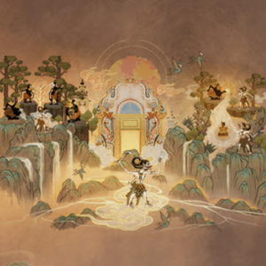
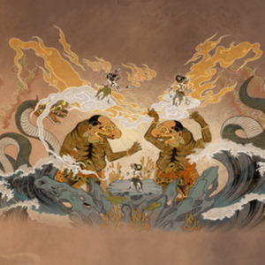
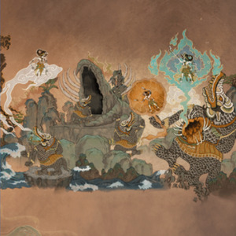
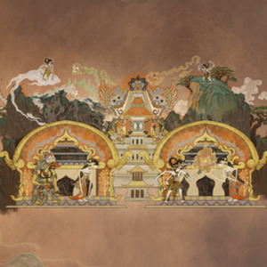
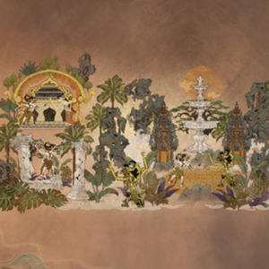
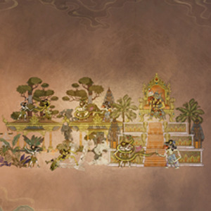
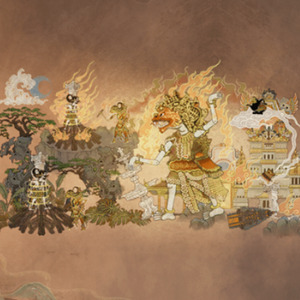

### Serat Lakon Anoman
> Dari gelap jadi terang. Sang perkasa dari legenda.

Pernahkah sebuah *event* di dalam gim membuatmu tertegun hingga lupa waktu?

Itulah yang saya rasakan saat menyimak kisah Anoman dalam perilisan *skin* Wukong-HOK awal Februari 2026 kemarin.

Narasi dan ilustrasinya begitu memikat hingga saya perlu mendokumentasikan dan menulis ulang kisah sang kera putih ini. Agar lakon yang begitu indah ini tidak lekang oleh waktu.

**Serat Lakon #1**

Prabu Ramawijaya duduk bersila di paseban istana. Sikapnya tenang, wibawanya memancar tanpa perlu ditampakkan. Namun, di balik keteduhan wajah sang Prabu, tersimpan kegelisahan yang tak terucap. Bayangan Dewi Sinta senantiasa hadir. la memahami benar, perang besar melawan Alengka tak dapat dimulai tanpa kepastian akan nasib sang pujaan hati.

Maka, Prabu Ramawijaya memanggil Anoman menghadap.

"Anoman, budhalo menyang Alengka. Tiliki kahanane Dewi Sinta." 
(Anoman, pergilah ke Alengka. Periksalah keadaan Dewi Sinta.)

Anoman segera sembah bakti. 
"Sendika dhawuh, Prabu." 
(Perintah diterima, Prabu.)

Sebelum memulai perjalanannya, Anoman memanggil para Punakawan, para penuntun batin yang selama ini membersamainya: Semar yang arif bijaksana, Gareng yang setya, Petruk yang cerdik, serta Bagong yang lugu namun jujur.

**Serat Lakon #2**

Belum jauh Anoman melintasi samudra, dua Buto raksasa utusan Rahwana menghadang di angkasa.

"Heh, Wanara!" teriak salah satunya. "Bali o! Segara iki dudu dalanmu!"

(Hey, kera! Kembalilah! Laut ini bukan jalanmu!)

"Yen isih nekat, nyawamu dadi tumbal Alengka!" sahut yang lain. 
(Jika tetap nekat, nyawamu akan menjadi tumbal Alengka!)

Anoman menatap mereka tanpa gentar. "Kowe kabeh mung wujud angkara," ucapnya tenang. "Angkara mesthi sirna dening dharma." 
(Kalian hanyalah perwujudan angkara. Dan angkara pasti kalah oleh dharma.)

Pertempuran pun pecah. Dengan kelincahan, tenaga, dan kesaktian yang dianugerahkan Batara Bayu, Anoman merobohkan kedua Buto itu. Tubuh mereka terhempas ke samudra, lenyap ditelan gelombang.

Tanpa menoleh, Anoman kembali terbang, menembus angin dan awan, menuju Alengka.

**Serat Lakon #3**

Di tengah perjalanan, berbagai makhluk laut mengintai Anoman dari balik ombak. Salah satunya adalah Wilkataksini, siluman buaya penunggu samudra.

"Wanara cilik," desis Wilkataksini, "segara iki dudu dalanmu. Awakmu bakal sirna ing wetengku!" 
(Kera kecil, laut ini bukan jalanmu. Tubuhmu akan lenyap di perutku!)

Tiba-tiba, Wilkataksini menyemburkan api beracun. Anoman terkejut, tubuhnya terhempas jatuh, dan seketika ditelan Wilkataksini.

Merasa menang, siluman itu kembali ke sarangnya. Namun, belum lama berselang, perutnya terasa perih luar biasa.

"Segara ora nduwe wenang milih sapa sing mati lan sapa sing urip!" suara Anoman menggema dari dalam. 
(Laut tak berhak menentukan siapa yang hidup dan siapa yang mati!) 
Pukulan demi pukulan menghantam dari dalam tubuh Wilkataksini. Tak sanggup menahan sakit, perutnya pun meledak. Anoman melesat keluar tanpa luka.

"Saklawase dharma lan kasetyan isih murub," ujar Anoman, "aku ora bakal sirna." 
(Selama dharma dan kesetiaan tetap menyala, aku takkan binasa.)

**Serat Lakon #4**

Anoman melanjutkan perjalanannya. Gunung, hutan, jurang, dan samudra ia lalui tanpa ragu. Tak satu pun sanggup menghentikan langkahnya.

Di Alengka, Rahwana terus merayu Dewi Sinta.

"Kabeh kamulyan Alengka tak aturake kanggo kowe," bujuknya. "Tinggalna Rama, dadi permaisuriku." 
(Segala kemuliaan Alengka kupersembahkan untukmu. Tinggalkan Rama dan jadilah permaisuriku.)

Dewi Sinta menjawab dengan teguh, "Kamulyan tanpa katresnan namung dadi kurungan. Sakjroning atiku namung kaisi Prabu Ramawijaya." 
(Kemuliaan tanpa cinta hanyalah penjara. Hatiku tetap milik Prabu Ramawijaya.)

Tak lama kemudian, Anoman tiba di atas Alengka. la mengamati istana dari udara hingga melihat celah kecil di puncak menara. 
Dengan aji panyusutan, ia mengecilkan diri dan berhasil menyelinap masuk.

"Dewi Sinta, aja wedi," ucapnya lirih. "Kulo dipun utus dening Prabu Ramawijaya." 
(Dewi Sinta, jangan takut. Aku utusan Prabu Ramawijaya.)

Awalnya Dewi Sinta ragu, hingga Anoman menunjukkan pusaka tanda pengenal beserta surat Prabu Ramawijaya. Setelah membacanya, keyakinan pun tumbuh di hati sang Dewi.

**Serat Lakon #5**

Dewi Sinta menolak pergi bersama Anoman.

"Iki," ujarnya sambil menyerahkan tusuk konde. "Aturaken marang Prabu Ramawijaya. Iki pratandha bilih aku taksih setya."

(Ambil ini dan berikanlah kepada Prabu Ramawijaya. Ini tanda bahwa aku masih setia.)

"Kulo jaga amanah punika," jawab Anoman. 
(Aku akan menjaga amanahmu.)

Meski tugas utamanya telah selesai, Anoman belum hendak kembali. la melangkah ke Taman Soka dan menghancurkannya, menantang Rahwana secara terbuka.

Saksodewo, putra Rahwana, datang dengan murka.

"Wanara edan! Taman Soka iki kamulyan Alengka!" 
(Kera gila! Taman Soka ini tanda kemuliaan Alengka!)

"Aku pancen sengaja," jawab Anoman tenang. 
(Aku memang sengaja.)

"Sopo sejatine kowe, wani nggampangake nagara kene?" 
(Siapa sebenarnya dirimu, sampai berani meremehkan negeri ini?)

Anoman berdiri tegak di antara puing-puing Taman Soka. Dadanya terangkat, sorot matanya tajam namun terkendali.

"Aku Anoman, utusaning Prabu Ramawijaya!" jawabnya lantang. 
(Aku Anoman, utusan Prabu Ramawijaya!)

Mendengar nama itu, wajah Saksodewo memerah oleh amarah. Harga dirinya sebagai putra Rahwana terusik.

"Yen mangkono," teriaknya geram, "kowe mungsuh Alengka sing kudu sirna!" 
(Kalau begitu, kau musuh Alengka yang harus binasa!)

Tanpa memberi kesempatan lagi, Saksodewo menyerbu dengan senjata terhunus. Anoman menyambutnya dengan kesiagaan penuh. Benturan tenaga dan kesaktian mengguncang Taman Soka yang telah porak-poranda.

Pohon-pohon tumbang, bangunan runtuh, tanah bergetar oleh amukan dua kekuatan yang saling berhadapan. Di tengah kekacauan itu, Anoman bertarung bukan semata demi kemenangan, melainkan sebagai pernyataan darma kepada angkara.

Pertarungan sengit pun berkobar di tengah reruntuhan Taman Soka, menandai awal kehancuran Alengka oleh tangan utusan Prabu Ramawijaya.

**Serat Lakon #6**

**Serat Lakon #7**

Serat Lakon 6
Pertarungan..

Serat Lakon 7
Anoman..
